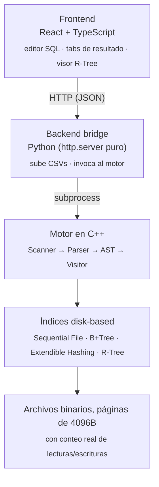

<div align="center">

# Motor de Base de Datos Disk-Based

Parser SQL propio · Sequential File · B+Tree · Extendible Hashing · R-Tree — todo corriendo sobre archivos binarios paginados, sin ningún engine externo de por medio.


</div>

El proyecto es un sistema gestor de bases de datos (DBMS) construido desde cero, sin apoyarse en ningún motor externo: el almacenamiento, los índices y el parser de SQL son implementaciones propias. La idea es entender cómo funciona un motor de base de datos por dentro, así que en vez de guardar todo en memoria, cada estructura escribe y lee directamente de archivos binarios en disco, paginados de a 4096 bytes y cada una de esas lecturas y escrituras queda contada, para poder medir el costo real de cada operación.

El proyecto incluye:

- Un parser de SQL propio, con su scanner, su gramática y su AST (`CREATE TABLE`, `CREATE INDEX`, `INSERT`, `SELECT`, `DELETE`)
- Cuatro formas de guardar y buscar datos: Sequential File, B+ Tree, Extendible Hashing y R-Tree
- Persistencia real en disco, con métricas de accesos y tiempos de ejecución por cada consulta
- Una interfaz web para escribir queries y ver los resultados, incluyendo una visualización de las búsquedas espaciales del R-Tree

**[Arquitectura](#arquitectura) · [Características](#características) · [SQL soportado](#sql-soportado) · [Stack tecnológico](#stack-tecnológico) · [Cómo correrlo](#cómo-correrlo) · [Estructura del repositorio](#estructura-del-repositorio) · [Tests](#tests)**

---

## Arquitectura

Separado en tres capas independientes, cada una con una responsabilidad clara:



El motor vive aislado en C++ puro, sin depender de HTTP ni de React. El bridge en Python no procesa nada, solo orquesta: recibe la query, invoca al binario y devuelve sus archivos de salida. Esa separación permite que el frontend cambie sin tocar el motor, y que el motor se pruebe por línea de comandos sin levantar nada más — así corren los tests.

---

## Características

- **Motor SQL propio** — `CREATE TABLE`, `CREATE INDEX`, `INSERT`, `SELECT` (con `WHERE`, `BETWEEN`, búsquedas espaciales) y `DELETE`, con scanner, parser recursivo-descendente y AST evaluado con el patrón *Visitor*.

- **Cuatro formas de guardar y buscar datos en disco**, cada una pensada para un caso distinto. El *Sequential File* es donde se guardan los registros; los otros tres son índices que apuntan hacia esos registros para encontrarlos más rápido según el tipo de búsqueda:

  - **Sequential File** — archivo principal ordenado + archivo auxiliar de inserciones con *rebuild* automático. Aquí vive el dato real.
  - **B+ Tree** — balanceado, con split/merge/redistribución, claves duplicadas y hojas enlazadas para range queries. Rápido tanto en búsquedas exactas como por rango.
  - **Extendible Hashing** — directorio dinámico expandible + MurmurHash3. El más rápido para `WHERE columna = valor`, aunque no sirve para rangos.
  - **R-Tree** (vía `libspatialindex`) — el único que soporta búsquedas espaciales: por rango circular y por *k*-vecinos más cercanos (kNN) sobre coordenadas.

- **Métricas reales de I/O** — cada lectura y escritura a disco se cuenta (`DiskCounter`), así que el rendimiento de cada estructura se compara con números reales, no solo con la complejidad teórica.

- **Frontend web** — editor SQL con resaltado de sintaxis, pestañas de resultado (tokens del scanner / AST / output de ejecución), carga de CSVs, y un visualizador 2D para las consultas espaciales del R-Tree (qué puntos calzan en el rango o el kNN, con distancia y ranking).

- **Todo dockerizado** — un solo `docker compose up` compila el motor en C++ (incluyendo `libspatialindex` desde cero) y levanta el frontend, sin que el usuario instale un compilador.

---

## SQL soportado

Gramática simplificada (ver [`Proyecto/grammar.txt`](Proyecto/grammar.txt) para el detalle completo en EBNF):

```sql
-- Crear tabla a partir de un CSV existente
CREATE TABLE personas FROM ("data.csv") (
    id       INT PRIMARY KEY,
    nombre   STRING,
    ubicacion POINT
);

-- Crear un índice explícito sobre una columna, eligiendo la estructura
CREATE INDEX BTREE idx_id ON personas;

-- Insertar
INSERT INTO personas VALUES (1, "Ana", (12.5, -77.0));

-- Búsquedas puntuales, por rango y espaciales
SELECT * FROM personas WHERE id = 1;
SELECT * FROM personas WHERE id BETWEEN 1 AND 100;
SELECT * FROM personas WHERE ubicacion IN (POINT(12.5, -77.0), RADIUS 5);
SELECT * FROM personas WHERE ubicacion IN (POINT(12.5, -77.0), K 10);

-- Eliminar
DELETE FROM personas WHERE id = 1;
```

Cada ejecución devuelve, además del resultado, los tokens que generó el scanner, el AST en formato `.dot`, y las métricas de tiempo y accesos a disco.

---

## Stack tecnológico

| Capa | Tecnología |
|---|---|
| Motor de base de datos | C++20, CMake |
| Índice espacial | [libspatialindex](https://libspatialindex.org/) (R-Tree) |
| Backend / bridge | Python 3, `http.server` (sin frameworks) |
| Frontend | React 19, TypeScript, Vite, Tailwind CSS 4 |
| Contenedores | Docker, Docker Compose |

---

## Cómo correrlo

Requisito único: [Docker Desktop](https://www.docker.com/products/docker-desktop/) instalado y abierto. No hace falta instalar un compilador de C++, Node ni Python — todo se compila dentro del contenedor.

```bash
git clone <url-de-este-repositorio>
cd BD2-proyecto
docker compose up -d --build
```

La primera vez tarda un par de minutos: está compilando `libspatialindex` y el motor de C++ desde cero dentro del contenedor. Las siguientes veces es casi instantáneo gracias al cache de capas de Docker.

Una vez levantado:

| Servicio | URL |
|---|---|
| Frontend (interfaz web) | http://localhost:5173 |
| Backend (API) | http://localhost:3000 |

Para bajarlo: `docker compose down`.

<details>
<summary>Correr solo el frontend con hot-reload (backend ya levantado)</summary>

```bash
cd FRONT-SQL
npm install
npm run dev
```

Por defecto apunta a `http://localhost:3000`; para cambiarlo, definir `VITE_API_URL` en un `.env` dentro de `FRONT-SQL/`.
</details>

---

## Estructura del repositorio

```
├── Proyecto/              Motor en C++
│   ├── Parser/            Scanner, Parser, AST, Visitor
│   ├── Index/              B+ Tree, Extendible Hashing
│   ├── Files/               Sequential File
│   ├── rtree/                Integración con libspatialindex
│   └── pruebas/               Tests de cada estructura de índice
├── FRONT-SQL/              Frontend en React + TypeScript
└── docker-compose.yml
```

## Tests

Cada estructura de índice tiene su propio test de tipo *oracle check*: inserta cientos de claves en orden aleatorio y verifica que todas sean recuperables, que el borrado no deje falsos positivos ni claves perdidas, y que los datos sobrevivan al cerrar y reabrir el archivo. Se compilan como binarios independientes (`test_bptree`, `test_ehashing`, `test_rtree`) junto con el motor principal.

---

<sub>Proyecto académico para el curso de Base de Datos 2.</sub>
